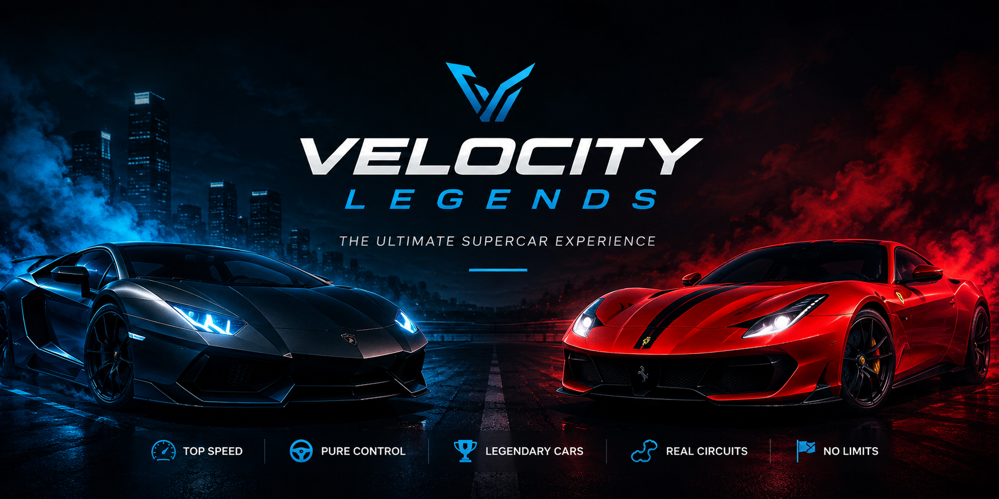

<p align="center">
  
</p>

<h1 align="center">🚗 Velocity Legends</h1>

<p align="center">
  Una experiencia inspirada en el mundo de los superdeportivos.
</p>

##### Velocity Legends es una página web inspirada en el mundo de los superdeportivos, donde los usuarios pueden descubrir algunos de los coches más rápidos del mundo, explorar sus características, conocer diferentes modos de conducción y visualizar galerías de imágenes con un diseño moderno y responsive.

---

## 🚀 Demo

🔗 https://gf3820591-sketch.github.io/velocity-legends2/

---

## ✨ Características

- 🎥 Hero con vídeo de fondo.
- 🚗 Catálogo de coches deportivos.
- 📊 Barras de estadísticas para cada vehículo.
- 🏁 Sección de modos de conducción.
- 🖼️ Galería interactiva.
- 🛣️ Sección de circuitos.
- 📩 Formulario de contacto.
- ⬆️ Botón "Back to Top".
- 📱 Diseño totalmente responsive.
- 🎨 Interfaz moderna con efectos hover y transiciones.

---

## 🛠️ Tecnologías utilizadas

- HTML5
- CSS3
- JavaScript (Vanilla JS)
- Google Fonts
- Font Awesome

---

## 📂 Estructura del proyecto

```
velocity-legends/
│
├── index.html
├── css/
│   └── style.css
├── js/
│   └── script.js
├── images/
├── videos/
└── README.md
```

---

## 🎯 Objetivos del proyecto

Este proyecto fue desarrollado para practicar:

- Maquetación con HTML5.
- Diseño moderno con CSS3.
- Responsive Design mediante Media Queries.
- Uso de Flexbox y CSS Grid.
- Manipulación del DOM con JavaScript.
- Animaciones y efectos visuales.
- Organización de un proyecto Front-End.

---

## 📱 Responsive

La página está optimizada para:

- 💻 Ordenadores
- 📱 Móviles
- 📲 Tablets

---

## 👨‍💻 Autor

Desarrollado por **Gabriel Flores**.

GitHub:https://github.com/gf3820591-sketch

---

## ⭐ Si te ha gustado

Si este proyecto te ha parecido interesante, puedes darle una ⭐ al repositorio.